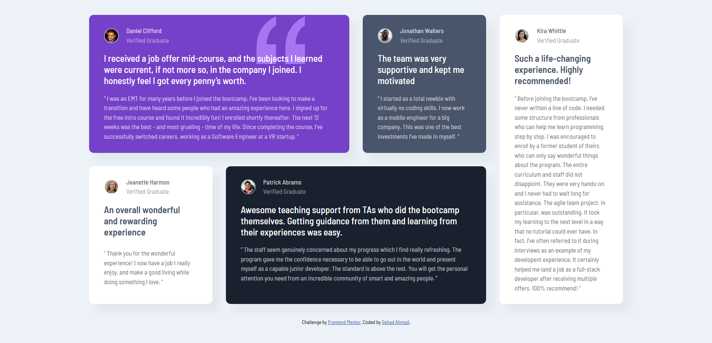

# Frontend Mentor - Testimonials grid section solution

This is a solution to the [Testimonials grid section challenge on Frontend Mentor](https://www.frontendmentor.io/challenges/testimonials-grid-section-Nnw6J7Un7). 

## Overview

### Screenshot

#### Desktop View

#### Mobile View

### Links

- Solution URL: [https://github.com/Gehad28/testimonials-grid-section](https://github.com/Gehad28/testimonials-grid-section)
- Live Site URL: [https://gehad28.github.io/testimonials-grid-section](https://gehad28.github.io/testimonials-grid-section)

## My process

### Built with

- Semantic HTML5 markup
- CSS custom properties
- Flexbox
- CSS Grid
- Descktop-first workflow

## Author

- Website - [Gehad Ahmad](https://github.com/Gehad28)
- Frontend Mentor - [@Gehad28](https://www.frontendmentor.io/profile/Gehad28)
